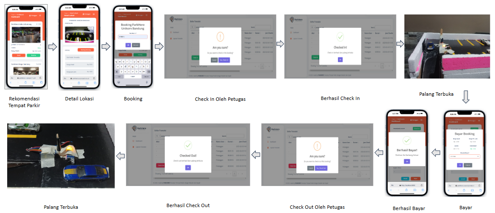

## About ParkHere

APlikasi rekomendasi tempat parkir disekitar dengan keamanan teknologi tinggi serta harga yang sangat transparan:

## Instalasi
- clone repo
- masuk folder, ketik di cmd
- ubah .env.example jadi .env
- `composer install`
- `php artisan key:generate`
- `php artisan serve`

## Production Access
```
[ RDP Access ]

RDP URL : http://panel.ourproject.my.id/7f6f160b
User       : kampus
Password   : kampus123

[  DB Access  ]
DB_CONNECTION    : mysql
DB_HOST          : 188.166.234.50
DB_PORT          : 3306
DB_DATABASE      : db_parkhere
DB_USERNAME      : db_parkhere
DB_PASSWORD      : 8HhEW2Z5yD63iCx4
```

## Task Menu
### 1. Admin
- [x] Admin Dashboard
- [x] Kelola Pengguna
- [x] Kelola Tempat Parkir
- [x] Laporan Transaksi

### 2. Petugas
- [x] Petugas Dashboard
- [x] Laporan Transaksi
      
### 3. Pelanggan
- [x] Pelanggan Dashboard
- [x] Riwatat Aktivitas

## Project Team
1. Edwin Liona Jaya - AI
2. Hanif Ahmad Syauqi - Backend Developer
3. Eri Sukmawan - UI/UX Designer & Frontend Developer
4. Alfatihnaman B - UI/UX Designer & Frontend Developer
5. Ilmi Fatturahman - IOT
6. Rafly Z - IOT

### Alur Proses
</a></p>

The Laravel framework is open-sourced software licensed under the [MIT license](https://opensource.org/licenses/MIT).
